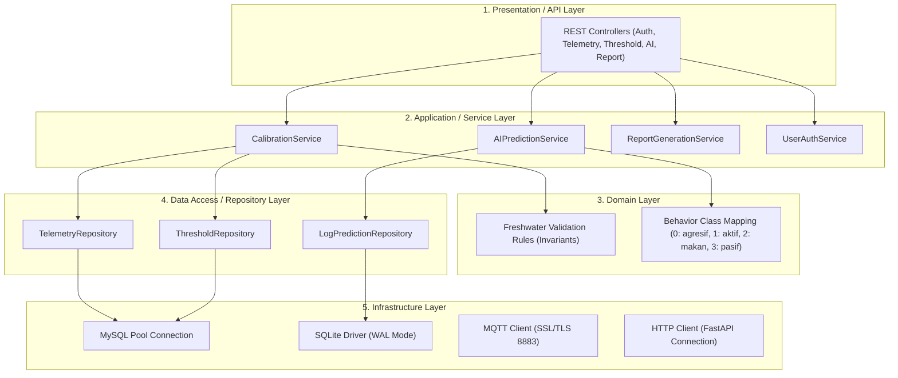

# Product Requirement Document (PRD) - Backend Service
## Lobsense V2.0 (Freshwater Lobster IoT Monitoring System)

---

## 1. Overview & Problem Statement
Sistem **Lobsense V1.0** (berbasis Laravel monolitik) memiliki masalah kinerja kritis (bottleneck) pada pemrosesan I/O tinggi secara sinkronus. Selain itu, terdapat perubahan fokus bisnis di mana habitat budidaya lobster dialihkan dari **air laut (saltwater)** ke **air tawar (freshwater)**.

**Lobsense V2.0 Backend** dirancang untuk memisahkan logika penyajian (decoupled) dengan arsitektur berlapis (*layered architecture*) yang terstruktur secara ilmiah. Backend ini bertugas mengelola ingesti data telemetri real-time, kalibrasi sensor fisik, integrasi API inferensi AI YOLOv8n, logging asinkron berkecepatan tinggi, dan penyediaan REST API publik untuk Frontend V2.0.

---

## 2. Goals & Non-Goals

### A. Goals
*   **Decoupled & Layered Architecture**: Membangun backend berbasis REST API dengan pemisahan tanggung jawab yang jelas antar-layer (API, Service, Repository, Database, Infrastructure, Cross-Cutting Concerns, Persistence, Security, dan Testing).
*   **Freshwater Adaptation**: Menghapus parameter salinitas dari visualisasi utama, menambahkan kolom `tds` terpisah dari `dissolved_oxygen` (DO), dan mengoreksi bias kalibrasi default untuk habitat air tawar.
*   **High-Throughput AI Proxy**: Mengoptimalkan endpoint `/api/detect` agar mampu memproses frame Base64 dan mem-proxy ke server FastAPI tanpa menulis file fisik secara sinkronus ke disk utama backend.
*   **Deadlock Mitigation**: Menerapkan database log prediksi AI berbasis SQLite dengan mode **WAL (Write-Ahead Logging)** untuk menampung request konkuren berkecepatan tinggi.
*   **Secure Telemetry Ingestion**: Mengintegrasikan Private MQTT Broker (Mosquitto SSL/TLS port 8883) dengan otentikasi kredensial berbasis ACL (*Access Control List*).

### B. Non-Goals
*   Membangun elemen antarmuka visual (UI/UX), CSS styling, presentasi grafik, atau pemutar video client-side (sepenuhnya tugas Frontend).
*   Melakukan kalkulasi inferensi model YOLOv8n secara lokal di CPU backend utama (inferensi didelegasikan ke FastAPI AI Server).

---

## 3. Detailed Architectural Layers Breakdown

### 3.1. Presentation / API Layer
Layer ini menangani siklus request-response HTTP, validasi skema input, serta serialisasi output ke dalam format JSON yang seragam.

#### API Registry & Endpoint Contract
Semua request wajib divalidasi format datanya sebelum masuk ke Service Layer.

| HTTP Method | Endpoint | Request Payload (Format & Validasi) | Success Response (JSON) | Error Response (JSON) |
| :--- | :--- | :--- | :--- | :--- |
| `POST` | `/api/auth-login` | `email` (string, email, required) `password` (string, min:8, required) | `200 OK` + Token JWT/Session, user metadata | `422 Unprocessable Entity` (Validasi) `401 Unauthorized` (Kredensial salah) |
| `POST` | `/api/detect` | `image` (string, base64 data URL, required) | `200 OK` `{ "total": int, "classes": { "aktif": int, ... }, "raw_predictions": [...] }` | `400 Bad Request` (Format base64 rusak) `502 Bad Gateway` (FastAPI mati) |
| `GET` | `/api/monitoringv2/{id}` | Path variable `id` (string, serial number node, required) | `200 OK` `{ "latest": {telemetry}, "data": [telemetry_every_5m] }` | `404 Not Found` (Node tidak terdaftar) |
| `POST` | `/api/treshold` | `iot_node_serial_number` (string, required) `variable` (string, required) `value_min` (numeric, required) `value_max` (numeric, required) `value` (numeric, optional, offset kalibrasi) `rules` (string, optional) | `201 Created` `{ "status": "success", "message": "Threshold updated" }` | `422 Unprocessable Entity` (Validasi) `500 Internal Error` |
| `GET` | `/api/report/raw-monitoring` | Query params: `node` (string, required), `startDate` (date, required), `endDate` (date, required), `format` (string, in:pdf,excel, required) | `200 OK` + Binary Stream File (PDF/Excel) | `400 Bad Request` (Format/Tanggal salah) `404 Not Found` |

---

### 3.2. Application / Service Layer
Berisi seluruh logika bisnis utama (*business rules orchestration*). Layer ini tidak boleh mengetahui detail protokol transport HTTP maupun detail kueri database SQL.

*   **`CalibrationService`**: 
    *   Menerima payload sensor mentah dari IoT Node.
    *   Mengambil parameter bias/offset dari `ThresholdRepository`.
    *   Melakukan kalibrasi matematis terpusat (*bias compensation* dan *clamping* batas aman).
    *   Menyimpan data hasil kalibrasi ke database melalui `TelemetryRepository`.
*   **`AIPredictionService`**: 
    *   Mengatur alur penerusan frame gambar Base64.
    *   Melakukan decoding Base64 ke struktur biner *in-memory* (buffer byte) tanpa menulis file ke disk.
    *   Membuat HTTP multipart request ke FastAPI `/predict`.
    *   Menerima output klasifikasi, menghitung persentase aktivitas kelas, dan memerintahkan `LogPredictionRepository` untuk menyimpan log ke SQLite WAL.
*   **`ReportGenerationService`**:
    *   Menghimpun data historis dari `TelemetryRepository` berdasarkan rentang tanggal.
    *   Melakukan aggregasi data (rata-rata harian, deviasi kualitas air).
    *   Mengekspor data ke library PDF engine (misal: Snappy/Dompdf) atau Excel engine (misal: PhpSpreadsheet/Go-Excelize).

---

### 3.3. Domain Layer
Mendefinisikan aturan bisnis inti, entitas, dan batasan (*invariants*) yang murni dan terlepas dari framework/database.

*   **Freshwater Quality Invariant Rules**:
    *   *Suhu Air*: Tidak boleh melenceng dari batas mutlak kelangsungan hidup lobster air tawar ($18^\circ\text{C} - 35^\circ\text{C}$). Kisaran ideal: $24^\circ\text{C} - 30^\circ\text{C}$.
    *   *pH Air*: Batas mutlak $5.0 - 9.5$. Kisaran ideal: $6.5 - 8.5$.
    *   *TDS*: Maksimum toleransi $1000\text{ ppm}$. Kisaran ideal: $150 - 400\text{ ppm}$.
    *   *DO (Dissolved Oxygen)*: Minimal $3.0\text{ mg/L}$. Kisaran ideal: $> 5.0\text{ mg/L}$.
*   **AI Class Definitions**:
    *   `0`: agresif
    *   `1`: aktif
    *   `2`: makan
    *   `3`: pasif

---

### 3.4. Data Access / Repository Layer
Menyediakan abstraksi akses data agar Service Layer tidak terikat langsung pada sintaks database (SQL/NoSQL).

*   **`TelemetryRepositoryInterface`**: Mengabstraksikan operasi penyimpanan dan pengambilan kueri time-series parameter kualitas air KJA.
*   **`ThresholdRepositoryInterface`**: Mengabstraksikan penyimpanan batas min/max dan parameter kalibrasi bias offset sensor.
*   **`LogPredictionRepositoryInterface`**: Mengabstraksikan pencatatan log JSON prediksi AI ke database SQLite WAL.

---

### 3.5. Infrastructure Layer
Mengelola koneksi fisik, pooling, konfigurasi socket, dan integrasi dengan layanan eksternal.

*   **MQTT Client Integration**:
    *   Koneksi ke **Private Mosquitto MQTT Broker**.
    *   Parameter: Port `8883`, Protokol MQTT over SSL/TLS (`mqtts`).
    *   *Keep-Alive Interval*: 60 detik.
    *   Penanganan *Reconnection & Backoff*: Mencoba menyambung kembali jika koneksi terputus dengan metode *Exponential Backoff*.
*   **AI Inference HTTP Client**:
    *   Koneksi ke **FastAPI AI Server** (`http://127.0.0.1:8000/predict`).
    *   Timeout batas atas: 2000ms. Jika terlampaui, lemparkan error `502 Bad Gateway` secara anggun.
*   **Database Pools**:
    *   MySQL Client Connection Pool: Max Active Connections = 50, Idle Connections = 10.
    *   SQLite WAL Connection: Driver SQLite3 dengan flag `PRAGMA journal_mode=WAL;` dan `PRAGMA busy_timeout=5000;` diaktifkan saat bootstrap database.

---

### 3.6. Cross-Cutting Concerns
Logika pendukung yang digunakan secara universal di seluruh layer aplikasi.

*   **Authentication & Authorization (RBAC Matrix)**:
    *   *Super User (su)*: Akses penuh (CRUD User, Perangkat, Database, Threshold, dan Reports).
    *   *Petugas Lapangan*: Akses read telemetri, input feeding log (`log_pakans`), maintenance log (`maintenances`), and AI live check. Tidak bisa merubah threshold atau CRUD User.
    *   *Owner/Direksi*: Hanya akses read telemetri dan mengekspor laporan historis.
*   **Logging & Observability**:
    *   Log setiap kegagalan parsing MQTT JSON payload.
    *   Log sensor outliers (data di luar invariant domain).
*   **Rate Limiting**:
    *   Endpoint `/api/detect` dibatasi maksimal **20 request per menit per Client IP** untuk mengamankan kapasitas komputasi GPU server AI dari serangan DDoS.
*   **Caching**:
    *   Cache data telemetri terbaru dari `/api/monitoringv2/{id}` selama **30 detik** menggunakan cache driver (Redis/In-Memory) guna mengurangi kueri langsung ke database MySQL saat banyak client membuka dashboard secara bersamaan.

---

### 3.7. Persistence Layer (Database Schema)

#### A. MySQL Schema
1.  **`users`**: Data admin/operator.
2.  **`i_o_t_nodes`**: Metadata unit pemancar sensor.
3.  **`monitoring_telemetries`**: Data sensor terkalibrasi.
    *   `id` (bigint unsigned, PK)
    *   `iot_node_serial_number` (string, FK, Indexed)
    *   `suhu_air` (float, Nullable)
    *   `ph` (float, Nullable)
    *   `tds` (float, Nullable, V2.0 kolom baru)
    *   `dissolved_oxygen` (float, Nullable, V2.0 murni sensor DO)
    *   `turbidity` (float, Nullable)
    *   `arus` (float, Nullable)
    *   `pitch` / `roll` / `yaw` (decimal 20,15, Nullable)
    *   `suhu` / `kelembapan` / `pressure` (float, Nullable - Udara)
    *   `created_at` (timestamp, Indexed)
3.  **`tresholds`**: Konfigurasi batas sensor dan kalibrasi.
    *   `id` (bigint unsigned, PK)
    *   `iot_node_serial_number` (string, FK)
    *   `variable` (string)
    *   `value_min` (double 8,2)
    *   `value_max` (double 8,2)
    *   `value` (double 8,2 - Offset Kalibrasi)
    *   `rules` (string, Nullable)

#### B. SQLite Schema (Log Predict)
*   Database file: `predict_logs.sqlite`
*   Tabel **`log_predictions`**:
    *   `id` (integer, PK, Autoincrement)
    *   `raw_prediction` (text / JSON, berisi koordinat bounding box `[x,y,w,h]` dan label kelas)
    *   `class_percentage` (text / JSON, berisi statistik sebaran kelas dalam persen)
    *   `created_at` (datetime)

---

### 3.8. Security Layer
*   **Input Sanitization**: Semua input string diproses menggunakan filter anti-XSS untuk mencegah injeksi script berbahaya.
*   **SQL Injection Prevention**: Kueri data wajib menggunakan Prepared Statements (via ORM/Eloquent/PDO secara aman).
*   **Secret Management**: Variabel sensitif (Password Database, Kredensial MQTT, FastAPI URL) disimpan dalam `.env` dan tidak boleh di-hardcode di dalam source code.

---

### 3.9. Testing Layer
*   **Unit Tests**:
    *   Memastikan `CalibrationService` melakukan pembacaan, kompensasi bias offset, dan clamping data secara akurat sesuai rumus matematika.
    *   Memastikan payload Base64 divalidasi dengan benar oleh API Layer.
*   **Integration Tests**:
    *   Menguji koneksi telemetry ingestion: Menerima dummy payload MQTT -> memanggil `CalibrationService` -> menyimpan ke MySQL.
    *   Menguji logging AI: Memanggil `/api/detect` -> FastAPI Mock Response -> Menyimpan ke SQLite WAL -> Membaca data log ter-update.
*   **E2E Tests**:
    *   Menguji alur lengkap autentikasi pengguna hingga penarikan laporan PDF/Excel.

---

## 4. Acceptance Criteria (Done When)
*   [x] Seluruh struktur direktori dan inisialisasi Git branch `backend` pada folder `Backend` terpasang secara tepat.
*   [ ] API Layer berhasil memvalidasi input skema dan merespons dengan kode HTTP yang sesuai (200, 201, 422, 502).
*   [ ] Ingesti telemetri via MQTT menyimpan data TDS secara mandiri ke kolom `tds` (tidak lagi menimpa kolom `dissolved_oxygen`).
*   [ ] AI Proxy `/api/detect` berhasil meneruskan request citra Base64 ke FastAPI dan menyimpan log JSON ke SQLite WAL tanpa kegagalan lock database.
*   [ ] Modul penarikan data historis berhasil mengekspor file PDF dan Excel yang tidak korup.
*   [ ] Seluruh konfigurasi sensitif diletakkan di dalam file `.env`.
