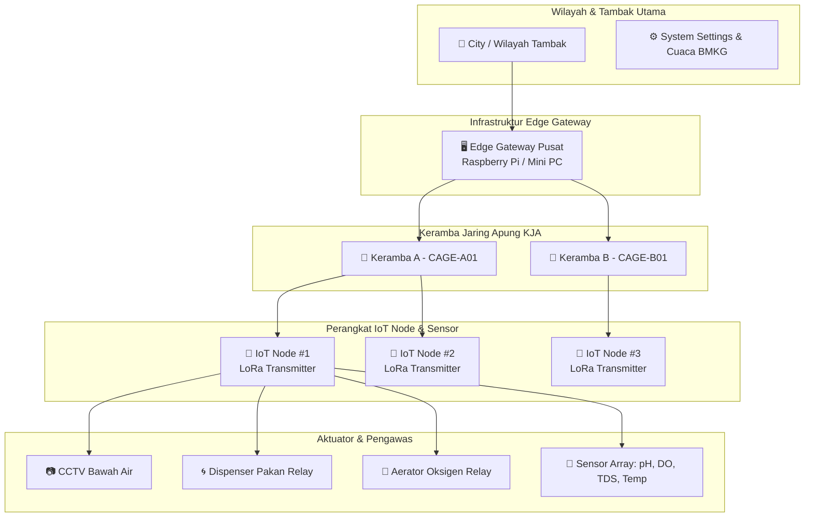

# 🦞 Lobsense V2.0 - Backend Service API

Selamat datang di repositori **Backend Service Lobsense V2.0**. Repository ini merupakan pusat layanan API (Application Programming Interface), pemrosesan data telemetri IoT real-time, manajemen master data tambak, ekspor laporan, dan gateway inferensi AI untuk platform pengawasan budidaya lobster modern **Edge Lobsense / Lobster Sensing System**.

---

## 📐 Arsitektur Sistem & Spesifikasi Teknologi

Sistem backend Lobsense V2 dibangun dengan arsitektur hibrida (*hybrid persistence*) yang menggabungkan *Relational Database* untuk data transaksional/master data dan *Time-Series Database* untuk skalabilitas penyimpanan telemetri data sensor frekuensi tinggi.

### Tech Stack & Dependensi Utama:
- **Framework Core**: Laravel 11.x (PHP 8.2+)
- **Relational Database**: MySQL 8.0 / PostgreSQL 15 (Master data, user, otentikasi, log pakan & pemeliharaan)
- **Time-Series Database**: InfluxDB v2 (`lobsense_telemetry` bucket untuk data historis pH, TDS, DO, Suhu, Salinitas, Turbiditas)
- **AI Inference Engine**: FastAPI + PyTorch YOLOv8 (Running pada Port 8001 untuk deteksi perilaku lobster dari frame CCTV)
- **API Documentation**: OpenAPI 3.0 dengan Swagger UI via `darkaonline/l5-swagger`
- **Otentikasi & Keamanan**: Laravel Sanctum (Token-based Bearer Authentication) & Role-Based Access Control (RBAC)
- **Protokol Komunikasi**: RESTful API (JSON / Multipart), MQTT (Penerima stream telemetri dari Edge Gateway), WebSocket

---

## 🗄️ Skema Database & Model Data

### Diagram Relasi Entitas (ERD)


### Penjelasan Struktur Tabel Utama:
1. **`users`**: Menyimpan kredensial pengguna, profil, dan hak akses (*role*).
2. **`provinces`**, **`cities`**, **`districts`**: Master wilayah Indonesia untuk pemetaan lokasi geografis tambak & Edge Gateway.
3. **`edge_gateways`**: Data perangkat keras Edge Gateway pusat di lokasi tambak yang menghubungkan banyak IoT Node.
4. **`cages` (Keramba Jaring Apung / KJA)**: Data fisik lokasi keramba, jumlah lobster, volume air, dan estimasi umur lobster.
5. **`iot_nodes`**: Perangkat sensor & aktuator lapangan yang terpasang di setiap keramba dan terhubung ke Edge Gateway.
6. **`cameras`**: Konfigurasi URL streaming RTSP/HLS kamera CCTV bawah air yang terhubung ke IoT Node.
7. **`sensor_types`** & **`thresholds`**: Definisi batas aman (*min/max*) dan offset kalibrasi sensor per node.
8. **`feeding_logs`**: Catatan riwayat pakan (otomatis maupun manual via mobile/web).
9. **`maintenances`**: Log servis, foto bukti pemeliharaan, dan tanda tangan digital operator.
10. **`system_settings`**: Pengaturan nama instansi, logo, dan koordinat tambak utama.

---

## 🔗 Diagram Relasi Fitur (KJA ↔ Edge Gateway ↔ IoT Node)

Berikut adalah diagram alir dan hirarki hubungan antara entitas **Keramba (KJA)**, **Edge Gateway**, dan **IoT Node**:



---

## 👥 Manajemen Hak Akses (Role-Based Access Control)

Backend menerapkan pembatasan hak akses berbasis peranan (*Role*):

| Role | Akses API & Fitur |
| :--- | :--- |
| **`admin`** | **Akses Penuh (Full Access)**: Memiliki wewenang CRUD penuh pada seluruh entitas, pengelolaan user, aktivasi perangkat, bulk update ambang batas, serta pembaruan pengaturan sistem & logo instansi. |
| **`management`** | **Pengawasan & Pelaporan**: Melihat seluruh dasbor monitoring, grafik telemetri, riwayat pemeliharaan, serta mengekspor dokumen laporan (PDF, CSV, Excel). Memiliki akses terbatas untuk mengedit data keramba & node. |
| **`operator`** | **Operasional Lapangan**: Melakukan registrasi & aktivasi perangkat baru, mengunggah foto bukti pemeliharaan & tanda tangan digital, mencatat pakan manual, serta memicu relai dispenser/aerator via Mobile App. |

---

## 🌐 Dokumentasi API Interaktif (Swagger UI)

Backend telah dilengkapi dengan portal dokumentasi OpenAPI 3.0 interaktif yang dapat diakses secara langsung saat server berjalan:

- **Portal Utama Swagger UI**: `http://localhost:8000/api/documentation`
- **Endpoint Alias**: `http://localhost:8000/api-documentation`
- **Spesifikasi JSON**: `http://localhost:8000/docs/api-docs.json`

---

## ⚙️ Panduan Instalasi & Pengoperasian Local

### 1. Prasyarat Sistem
- PHP `>= 8.2` (dengan ekstensi `pdo`, `mbstring`, `gd`, `xml`, `curl`)
- Composer `>= 2.5`
- Database Server: MySQL 8.0+ atau PostgreSQL
- InfluxDB v2 (Opsional untuk data time-series lokal, fallback mock otomatis aktif jika offline)

### 2. Langkah-Langkah Instalasi

```bash
# 1. Masuk ke direktori Backend
cd Backend

# 2. Install dependensi composer
composer install

# 3. Salin file lingkungan .env
cp .env.example .env

# 4. Generate Application Key
php artisan key:generate

# 5. Buat tautan direktori penyimpanan publik (storage link)
php artisan storage:link

# 6. Jalankan Migrasi Database & Seeder Data Awal
php artisan migrate:fresh --seed

# 7. Generate Dokumentasi Swagger OpenAPI
php artisan l5-swagger:generate

# 8. Jalankan Server Lokal Laravel
php artisan serve --port=8000
```

Backend API siap diakses di `http://localhost:8000/api/v2`.
