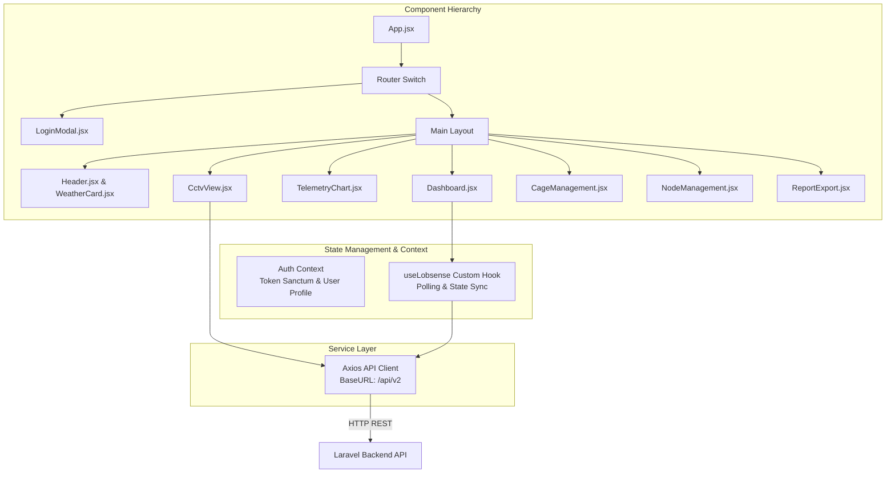
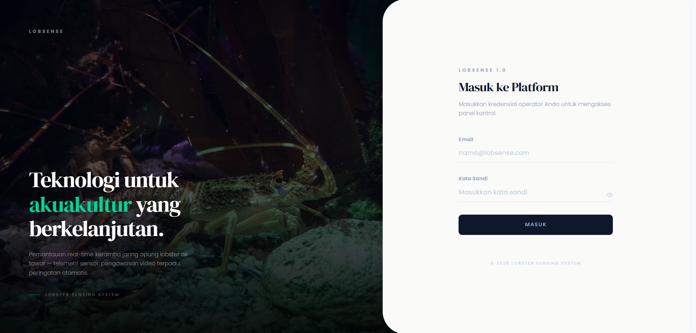
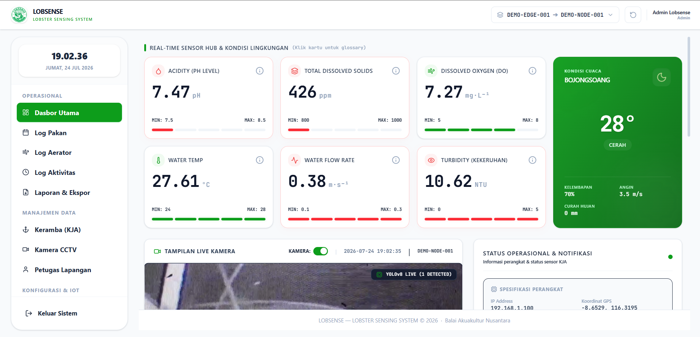

# Lobsense V2 - Frontend Web Application

Repositori ini berisi kode sumber antarmuka web Single Page Application (SPA) berbasis React 18 untuk platform pengawasan dan pemantauan budidaya tambak lobster **Lobsense V2**. Antarmuka ini terhubung langsung ke Backend REST API untuk menyajikan data telemetri, analisis grafik historis, pengawasan CCTV berbasis Computer Vision, dan manajemen operasional tambak.

---

## 1. Spesifikasi Stack Teknologi

- **Framework Core**: React 18 (Build Tool: Vite)
- **Styling Architecture**: Vanilla CSS Custom Tokens & Tailwind CSS v3
- **Icon Library**: Lucide React & FontAwesome
- **Data Visualization**: Chart.js & React-Chartjs-2 (Visualisasi 24 jam parameter pH, DO, TDS, Suhu Air, Salinitas, dan Turbiditas)
- **HTTP Client**: Axios (dengan Interceptor Bearer Token Sanctum)
- **Real-time Canvas Rendering**: HTML5 Canvas API untuk menggambar bounding box hasil inferensi AI YOLOv8 pada stream CCTV

---

## 2. Arsitektur Komponen & Alur Data Frontend



---

## 3. Pemetaan Komponen Antarmuka ke Endpoint API Backend

Tabel berikut menjelaskan pemetaan antara komponen antarmuka web dengan endpoint REST API Backend V2:

| Modul Antarmuka | File Komponen (`src/components/`) | Endpoint API Backend | Deskripsi Fungsi |
| :--- | :--- | :--- | :--- |
| **Autentikasi** | `LoginModal.jsx` | `POST /api/v2/auth/login`<br/>`POST /api/v2/auth/logout` | Autentikasi kredensial pengguna dan pengelolaan sesi token Bearer. |
| **Profil Pengguna** | `UserProfile.jsx` | `GET /api/v2/profile`<br/>`PUT /api/v2/profile` | Menampilkan dan memperbarui data profil pengguna terautentikasi. |
| **Header Status & Cuaca** | `Header.jsx`, `WeatherCard.jsx` | `GET /api/v2/weather/latest`<br/>`GET /api/v2/system-settings` | Menyajikan data cuaca BMKG lokal, logo instansi, dan parameter sistem. |
| **Dasbor Telemetri** | `Dashboard.jsx`, `SensorCard.jsx` | `GET /api/v2/monitoring/dashboard/{serial_number}` | Mengambil indikator sensor real-time, ambang batas aman, dan ringkasan 24 jam. |
| **Grafik Analytics** | `TelemetryChart.jsx` | `GET /api/v2/monitoring/history/{serial_number}` | Visualisasi tren historis sensor dengan opsi resolusi temporal (raw, 1h, 1d). |
| **CCTV & AI Vision** | `CctvView.jsx` | `POST /api/v2/detect`<br/>`GET /api/v2/cameras` | Mengirimkan frame canvas ke AI proxy server dan menggambar bounding box deteksi lobster. |
| **Manajemen Keramba (KJA)** | `CageManagement.jsx` | `GET /api/v2/cages`<br/>`POST /api/v2/cages`<br/>`PUT /api/v2/cages/{id}` | Pengelolaan data spasial KJA, volume air, dan estimasi populasi lobster. |
| **Manajemen IoT Node** | `NodeManagement.jsx` | `GET /api/v2/iot-nodes-master`<br/>`POST /api/v2/iot-nodes-master` | Manajemen master IoT Node, channel gateway LoRa, dan alamat IP. |
| **Aktivasi & Pemeliharaan** | `DeviceActivation.jsx`, `MaintenanceModal.jsx` | `POST /api/v2/devices/validate-serial`<br/>`POST /api/v2/devices/activate`<br/>`POST /api/v2/maintenances` | Alur registrasi unit perangkat baru dan submit laporan servis dengan tanda tangan digital. |
| **Pemberian Pakan** | `FeedingControl.jsx` | `GET /api/v2/feeding-logs`<br/>`POST /api/v2/feeding-logs` | Kontrol dispenser pakan otomatis dan pencatatan log pakan manual. |
| **Ekspor Laporan** | `ReportExport.jsx` | `GET /api/v2/reports`<br/>`GET /api/v2/reports/{type}/{format}` | Generator dan pengunduh dokumen laporan PDF, CSV, dan Excel. |

---

## 4. Dokumentasi Gambar Antarmuka (Screenshot Placement Slots)

*Catatan untuk Tim Pengembang: Harap letakkan file screenshot antarmuka pada direktori `Frontend/docs/screenshots/`.*

### 4.1 Tangkapan Layar Halaman Login
> Silakan simpan file screenshot halaman login dengan nama `login_page.png` pada lokasi: `Frontend/docs/screenshots/login_page.png`.



*Keterangan*: Halaman login mendukung autentikasi bertingkat berbasis peranan (*admin*, *management*, *operator*).

### 4.2 Tangkapan Layar Halaman Dasbor Utama
> Silakan simpan file screenshot halaman dasbor utama dengan nama `dashboard_page.png` pada lokasi: `Frontend/docs/screenshots/dashboard_page.png`.



*Keterangan*: Tampilan pusat kontrol pemantauan KJA real-time yang mencakup indikator parameter air, widget cuaca BMKG, player stream CCTV dengan overlay AI, kontrol sakelar aerator/feeder, dan tabel log aktivitas.

---

## 5. Saran & Rekomendasi Arsitektur Frontend

1. **Progressive Web App (PWA)**: Implementasi Service Worker dan Cache API untuk mendukung pembacaan dasbor dalam kondisi koneksi internet terbatas.
2. **WebRTC Integration**: Migrasi protokol streaming video dari HLS/RTSP ke WebRTC untuk mengurangi latensi transmisi CCTV di bawah 500ms.
3. **WebSocket Native Listener**: Mengganti mekanisme polling HTTP berkala dengan WebSocket listener untuk pembaruan instan indikator telemetri.

---

## 6. Panduan Pengoperasian Lokal

```bash
# 1. Masuk ke direktori Frontend
cd Frontend

# 2. Install dependensi modul Node.js
npm install

# 3. Jalankan server pengembangan lokal (Vite)
npm run dev
```

Aplikasi web dapat diakses melalui peramban pada `http://localhost:5173`.
