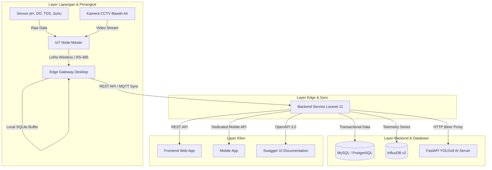
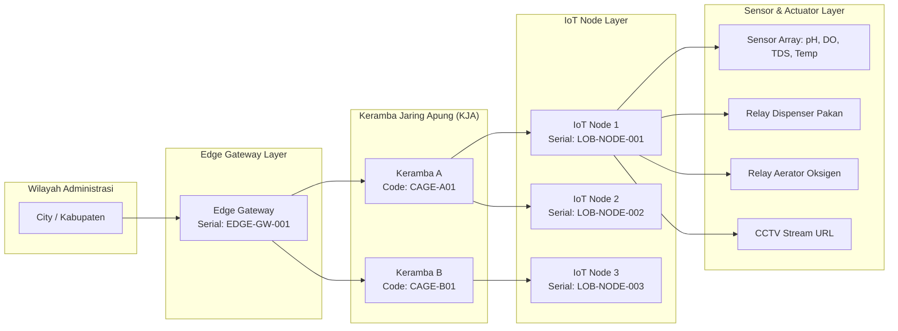

# Lobsense V2 - Backend API & System Infrastructure

Backend Service Lobsense V2 merupakan pusat pemrosesan data, manajemen master data tambak, pengolahan telemetri sensor real-time, ekspor laporan, dan gateway inferensi Artificial Intelligence (AI) untuk platform pemantauan budidaya lobster **Lobster Sensing System**.

---

## 1. Arsitektur Sistem & Spesifikasi Teknologi

Sistem backend menggunakan arsitektur hibrida (*hybrid persistence architecture*) untuk memisahkan penyimpanan data transaksional terstruktur dengan data telemetri waktu (*time-series data*) frekuensi tinggi.

### 1.1 Stack Teknologi Core
- **Application Framework**: Laravel 11.x (PHP 8.2+)
- **Relational Database**: MySQL 8.0 / PostgreSQL 15 (Master data, user, otentikasi, log pakan, dan servis)
- **Time-Series Database**: InfluxDB v2 (Penyimpanan instan dan agregasi historis sensor pH, DO, TDS, Suhu, Salinitas, Turbiditas)
- **AI Inference Gateway**: FastAPI + PyTorch YOLOv8 (Inference server independen pada port 8001)
- **API Documentation**: OpenAPI 3.0 Specification via L5-Swagger (`darkaonline/l5-swagger`)
- **Authentication**: Laravel Sanctum (Token-based Bearer Authentication)
- **Protocols**: RESTful API (JSON / Multipart), MQTT Listener, WebSockets

### 1.2 Diagram Arsitektur Data & Alur Komunikasi



---

## 2. Skema Database & Relasi Tabel

### 2.1 Entity Relationship Diagram (ERD)


### 2.2 Penjelasan Struktur Tabel Utama

- **`users`**: Menyimpan kredensial pengguna, profil, dan peranan (*role*).
- **`provinces`**, **`cities`**, **`districts`**: Master data wilayah administrasi Indonesia untuk lokasi tambak dan Edge Gateway.
- **`edge_gateways`**: Data spesifikasi teknis dan lokasi Edge Gateway di stasion darat.
- **`cages` (Keramba Jaring Apung / KJA)**: Data fisik lokasi keramba, koordinat geografis, volume air, populasi, dan estimasi umur lobster.
- **`iot_nodes`**: Data master unit IoT Node yang terpasang pada masing-masing keramba.
- **`cameras`**: Konfigurasi URL stream RTSP/HLS kamera CCTV bawah air per node.
- **`sensor_types`** & **`thresholds`**: Konfigurasi batas kritis (*min/max*) dan nilai offset kalibrasi sensor per node.
- **`feeding_logs`**: Catatan riwayat pemberian pakan otomatis maupun manual.
- **`maintenances`**: Log pemeliharaan perangkat, foto servis, dan tanda tangan digital operator.
- **`system_settings`**: Konfigurasi global sistem, nama instansi, logo, dan koordinat tambak utama.

---

## 3. Diagram Topologi & Relasi Fitur (Keramba - Edge Gateway - IoT Node)

Berikut adalah struktur hubungan hirarki dan keterkaitan data antara Keramba (KJA), Edge Gateway, dan IoT Node:



---

## 4. Matriks Hak Akses Pengguna (Role-Based Access Control)

Backend menerapkan kontrol akses berbasis peranan untuk mengamankan endpoint API:

| Modul / Endpoint Group | User Role: `admin` | User Role: `management` | User Role: `operator` |
| :--- | :---: | :---: | :---: |
| **Authentication & Profile** | Full Access | Full Access | Full Access |
| **Monitoring Telemetry Read** | Full Access | Full Access | Read-Only |
| **Master Data (Cages, Nodes, Gateways, Cameras)** | Full Access (CRUD) | Read-Only | Read-Only |
| **Device Activation & Maintenance Submit** | Full Access | Read-Only | Create & Read |
| **Threshold Configuration & System Settings** | Full Access (Update) | Read-Only | Read-Only |
| **Feeding Logs & Manual Control** | Full Access | Read-Only | Create & Read |
| **Reports Data & File Export (PDF/CSV/Excel)** | Full Access | Full Access (Export) | Read-Only |

---

## 5. Dokumentasi API Interaktif (OpenAPI 3.0 / Swagger)

Dokumentasi API lengkap dengan skema request/response dan pengujian interaktif dapat diakses saat server berjalan:

- **Swagger UI Portal**: `http://localhost:8000/api/documentation`
- **Swagger UI Alias**: `http://localhost:8000/api-documentation`
- **OpenAPI 3.0 JSON Spec**: `http://localhost:8000/docs/api-docs.json`

---

## 6. Panduan Instalasi & Konfigurasi Lokal

### 6.1 Prasyarat Lingkungan
- PHP `>= 8.2` (Ekstensi: `pdo`, `mbstring`, `gd`, `xml`, `curl`, `zip`)
- Composer `>= 2.5`
- Database Server: MySQL 8.0+ atau PostgreSQL
- InfluxDB v2 (Opsional, fallback otomatis aktif jika server TSDB offline)

### 6.2 Langkah Instalasi

```bash
# 1. Masuk ke direktori Backend
cd Backend

# 2. Install dependensi PHP via Composer
composer install

# 3. Buat file konfigurasi lingkungan
cp .env.example .env

# 4. Generate Application Encryption Key
php artisan key:generate

# 5. Buat symbolic link untuk direktori storage
php artisan storage:link

# 6. Jalankan migrasi database dan penyemaian data awal
php artisan migrate:fresh --seed

# 7. Generate dokumentasi Swagger OpenAPI
php artisan l5-swagger:generate

# 8. Jalankan server lokal Laravel
php artisan serve --port=8000
```

Layanan Backend API akan berjalan pada `http://localhost:8000`.
