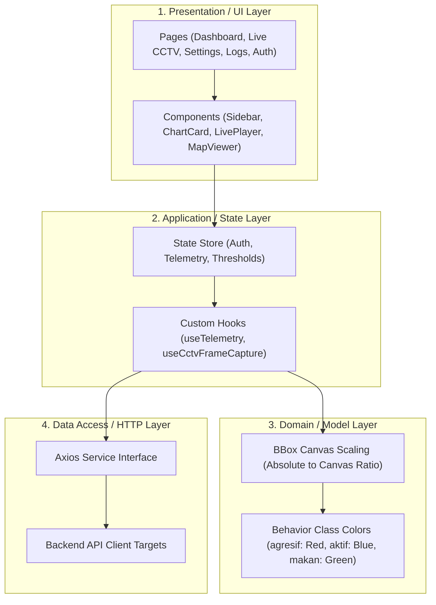

# Product Requirement Document (PRD) - Frontend Service
## Lobsense V2.0 (Freshwater Lobster IoT Monitoring System)

---

## 1. Overview & Problem Statement
Frontend Lobsense V1.0 dibangun secara monolitik di dalam aplikasi Laravel menggunakan framework Bootstrap yang saat ini sudah terasa jadul secara estetika (UI/UX) dan tidak responsif. Rendering grafik telemetri sensor masih lambat dan visualisasinya kurang menarik.

Pada V2.0, Frontend akan dibangun ulang secara terdekopel (*decoupled client-side app*) menggunakan modern stack (seperti React/Vite atau Next.js) dengan Vanilla CSS atau TailwindCSS. Frontend bertugas menyajikan antarmuka premium, memutar CCTV HLS, menangkap frame berkala untuk dikirim ke API deteksi AI, dan merender kotak koordinat (*bounding box*) di atas video secara *real-time*.

---

## 2. Goals & Non-Goals

### A. Goals
*   **Decoupled Frontend**: Aplikasi client-side murni yang berkomunikasi dengan Backend V2.0 melalui REST API.
*   **Premium UI/UX Design**: Mengimplementasikan visual modern dengan estetika tinggi (Harmonious Dark Mode, efek Glassmorphism, Responsive Grid, modern typography, dan micro-animations pada ikon/widget).
*   **Real-Time Data Visualization**: Grafik interaktif (misal Chart.js/Recharts) untuk telemetri kualitas air tawar dan komponen grafis 3D/rotasi untuk sumbu *Pitch, Roll, dan Yaw* (stabilitas KJA).
*   **Dynamic Mapping**: Integrasi peta (Leaflet.js atau Mapbox) untuk menampilkan marker lokasi KJA dan IoT Node secara dinamis.
*   **AI Bounding Box Overlay Canvas**: Pemutar CCTV HLS yang di-overlay dengan HTML5 Canvas untuk menggambar koordinat deteksi objek (`aktif`, `pasif`, `agresif`, `makan`) secara real-time.
*   **Responsive Forms & Exports**: Halaman admin penginputan log pakan/pemeliharaan serta antarmuka filter laporan historis untuk ekspor PDF/Excel.

### B. Non-Goals
*   Melakukan interaksi database SQL secara langsung atau menyimpan data (semua melalui Backend REST API).
*   Melakukan kalkulasi inferensi model YOLOv8 secara lokal (didelegasikan via API `/api/detect` ke FastAPI).

---

## 3. Detailed Architectural Layers Breakdown

### 3.1. Presentation / UI Layer
Layer ini fokus pada penyajian visual komponen dan halaman yang ramah pengguna, responsif di berbagai perangkat, serta kaya akan transisi halus.

*   **Views/Pages**:
    *   *Login*: Halaman autentikasi dengan transisi transparan (*glassmorphism*).
    *   *Dashboard*: Menampilkan widget parameter air tawar (Suhu Air, pH, TDS, DO, Turbidity, Arus), widget 3D stabilitas KJA (pitch, roll, yaw), dan peta Leaflet.
    *   *CCTV Live Overlay*: Halaman pemutar HLS stream dengan canvas overlay AI.
    *   *Data Master & Logs*: Tabel dinamis dengan filter tanggal untuk log pakan, pemeliharaan, dan histori telemetri.
    *   *Settings*: Antarmuka konfigurasi nilai batas (*thresholds*) sensor.
*   **Shared Components**:
    *   `Sidebar` & `Header` navigation.
    *   `InteractiveChart` (Recharts/Chart.js) dengan gradien warna di bawah garis grafik.
    *   `HlsPlayerCanvas`: Player video HLS kustom yang dibungkus dengan absolute-positioned HTML5 Canvas.

---

### 3.2. Application / State Layer
Mengelola status aplikasi (*global/local state*), siklus hidup data, notifikasi, dan orkestrasi pengambilan frame video.

*   **Global State (Zustand/Redux/Context)**:
    *   `AuthStore`: Menyimpan status token JWT user dan informasi profil.
    *   `TelemetryStore`: Menyimpan data sensor real-time terakhir dan data time-series 10 poin terakhir.
    *   `ThresholdStore`: Menyimpan daftar konfigurasi min/max parameter untuk evaluasi visual status warna.
*   **Custom React Hooks / Orchestrators**:
    *   `useTelemetry(nodeId)`: Mengaktifkan polling berkala (setiap 5 detik) ke API `/api/monitoringv2/{id}` untuk memperbarui dashboard.
    *   `useCctvFrameCapture(videoRef, canvasRef)`:
        *   Memicu interval 5 detik.
        *   Menangkap bingkai (*frame*) dari elemen `<video>` ke dalam Canvas tersembunyi.
        *   Mengonversi frame ke Base64.
        *   Mengirim Base64 ke Backend API `/api/detect`.
        *   Menerima koordinat koordinat, melakukan penskalaan ratio, dan menggambar kotak pembatas di `canvasRef` utama.

---

### 3.3. Domain / Model Layer
Layer berisi aturan representasi visual dan matematika lokalisasi objek client-side.

*   **Bounding Box Scaling Invariant**:
    *   FastAPI mengembalikan koordinat pusat dan dimensi ternormalisasi $[x, y, w, h]$ (dalam skala 0.0 sampai 1.0).
    *   Frontend bertanggung jawab mengalikan nilai ini dengan lebar ($W_{canvas}$) dan tinggi ($H_{canvas}$) aktual elemen canvas di layar agar kotak digambar di tempat yang tepat:
        $$\text{Lebar Box} = w \times W_{canvas}$$
        $$\text{Tinggi Box} = h \times H_{canvas}$$
        $$\text{Titik Kiri Atas X} = (x \times W_{canvas}) - \frac{\text{Lebar Box}}{2}$$
        $$\text{Titik Kiri Atas Y} = (y \times H_{canvas}) - \frac{\text{Tinggi Box}}{2}$$
*   **Behavior Class Color Invariant**:
    *   `agresif`: Merah terang (`#EF4444`) untuk memicu perhatian petugas.
    *   `makan`: Hijau daun (`#10B981`) menandakan aktivitas mengonsumsi pakan.
    *   `aktif`: Biru cyan (`#06B6D4`) menandakan pergerakan sehat normal.
    *   `pasif`: Abu-abu abu (`#6B7280`) menandakan diam/istirahat.

---

### 3.4. Data Access / HTTP Layer
Mengurus koneksi HTTP ke REST API Backend V2.0 menggunakan library client.

*   **Axios Config**:
    *   `baseURL` mengambil alamat IP/Domain backend dari file konfigurasi `.env`.
    *   Interseptor request untuk menyisipkan header `Authorization: Bearer <token>` secara otomatis pada setiap request jika token tersedia di store.
    *   Interseptor response untuk menangani error `401 Unauthorized` secara terpusat (redirect ke halaman login jika token kedaluwarsa).

---

### 3.5. Cross-Cutting Concerns
*   **Input Validation**: Validasi format email pada form login, validasi rentang angka threshold pada form pengaturan (misal: pH tidak boleh diisi > 14 atau < 0).
*   **Error Boundaries & State Handling**:
    *   *Loader State*: Skeleton loading animasi saat grafik/data sensor sedang diambil dari API.
    *   *Offline Fallback*: Menampilkan notifikasi visual "CCTV Offline" atau "Koneksi Bermasalah" jika server API backend gagal dihubungi.

---

### 3.6. Security Layer
*   **XSS Protection**: Memastikan semua input teks yang dimasukkan user disanitasi dan tidak di-render langsung menggunakan metode rentan seperti `dangerouslySetInnerHTML` tanpa pembersihan.
*   **URL Sanitization**: Memvalidasi URL streaming HLS sebelum dimuat ke pemutar video guna menghindari serangan *CORS injection* atau pengalihan video berbahaya.

---

### 3.7. Testing Layer
*   **Unit Tests**: Menguji kebenaran fungsi matematika kalkulasi bounding box scaling.
*   **Component Tests**: Menguji apakah komponen `HlsPlayerCanvas` mampu memuat library player secara dinamis dan tidak mengalami kebocoran memori (*memory leak*).
*   **E2E Tests (Browser Use)**: Menguji alur lengkap login, melihat dasbor sensor, membuka CCTV live, hingga mengklik tombol ekspor laporan.

---

## 4. Acceptance Criteria (Done When)
*   [ ] Seluruh struktur direktori dan inisialisasi Git branch `frontend` pada folder `Frontend` terpasang secara tepat.
*   [ ] Halaman dasbor berhasil merender grafik real-time dan widget 3D/kemiringan KJA dari data API.
*   [ ] Peta Leaflet/Mapbox menampilkan marker lokasi KJA dengan popup informasi sensor terkini dengan benar.
*   [ ] Player CCTV berhasil memutar umpan HLS dan menggambar kotak pembatas AI perilaku lobster di atas layar dengan warna yang sesuai.
*   [ ] Form threshold berhasil memperbarui konfigurasi di backend dan mengubah respons warna dashboard.
